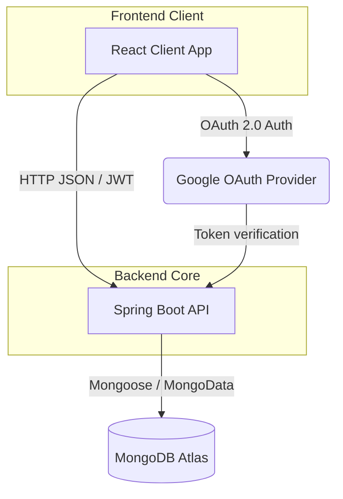
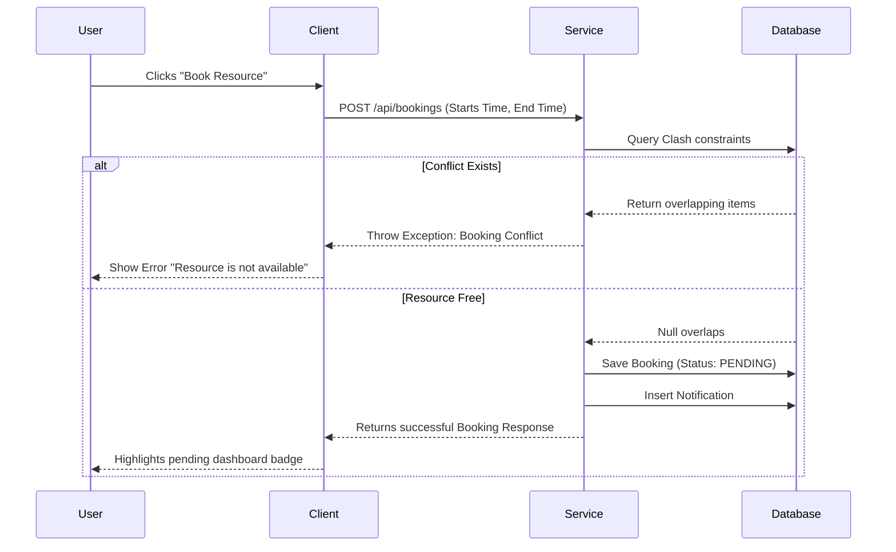

# Smart Campus Hub - Architecture Diagrams

## 1. System Architecture

```mermaid
graph TD
    Client[React Client App]
    API[Spring Boot API]
    DB[(MongoDB Atlas)]
    Google(Google OAuth Provider)

    Client -- "HTTP JSON / JWT" --> API
    API -- "Mongoose / MongoData" --> DB
    Client -- "OAuth 2.0 Auth" --> Google
    Google -- "Token verification" --> API

    subgraph Backend Core
      API
    end

    subgraph Frontend Client
      Client
    end
```

## 2. Module Interactions Flow

```mermaid
sequenceDiagram
    participant User
    participant Client
    participant Service
    participant Database

    User->>Client: Clicks "Book Resource"
    Client->>Service: POST /api/bookings (Starts Time, End Time)
    Service->>Database: Query Clash constraints
    alt Conflict Exists
        Database-->>Service: Return overlapping items
        Service-->>Client: Throw Exception: Booking Conflict
        Client-->>User: Show Error "Resource is not available"
    else Resource Free
        Database-->>Service: Null overlaps
        Service->>Database: Save Booking (Status: PENDING)
        Service->>Database: Insert Notification
        Service-->>Client: Returns successful Booking Response
        Client-->>User: Highlights pending dashboard badge
    end
```
